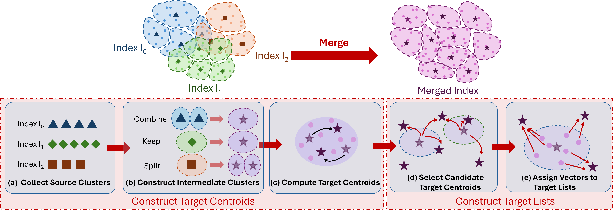
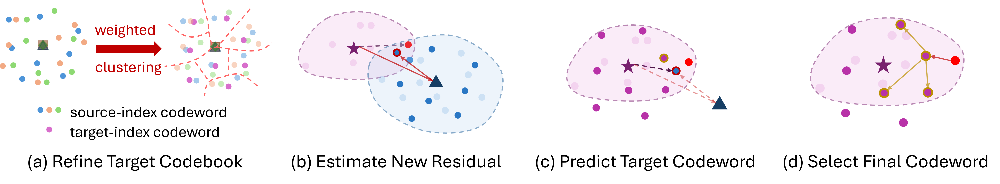
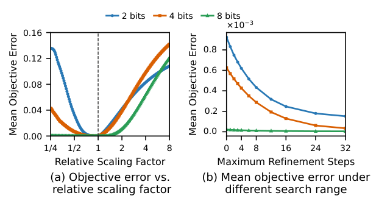
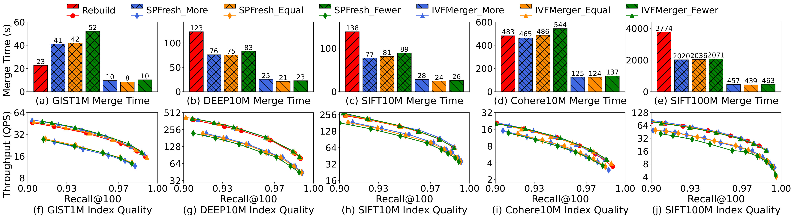
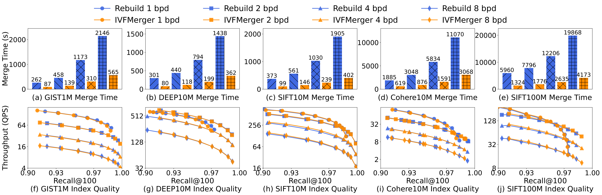
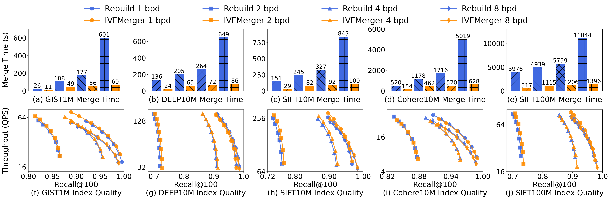

# Efficient IVF-based Vector Index Merging in Vector Databases

Vector index merging is a key operation in parallel index construction and segment maintenance in vector databases. Independently constructed IVF indexes can have different centroids and quantization codebooks. Rebuilding a target index from scratch discards the clustering and encoding work already captured in the source indexes.

IVFMerger reuses source index information to construct one target index. For IVF_Flat, it reuses source centroids and inverted lists to accelerate target centroid training and vector reassignment. For IVF_PQ, it also reuses source codebooks and codes to accelerate target codebook construction and code generation. For IVF_RaBitQ, it reuses source scaling factor information to reduce encoding work for multibit configurations. Raw vectors are available to the merge algorithms. The resulting indexes retain the standard Faiss formats and query procedures.

The paper evaluates five datasets containing up to 100 million vectors. Compared with rebuilding, IVFMerger achieves merge speedups of 2.2 ∼ 8.6× for IVF_Flat, 3.0 ∼ 4.8× for IVF_PQ, and 2.2 ∼ 8.7× for IVF_RaBitQ, while maintaining comparable or higher index quality.

## 1. Repository Overview

This repository extends [Faiss](https://github.com/facebookresearch/faiss) with C++ implementations of the three merge algorithms.

```text
./
├── faiss/
│   ├── IndexIVFFlatMerge.h/.cpp       # Shared IVF options and IVF_Flat merging
│   ├── IndexIVFFlatMergeMT.h/.cpp     # Multithreaded IVF_Flat implementation
│   ├── IndexIVFPQMerge.h/.cpp         # IVF_PQ codebook construction and reencoding
│   ├── IndexIVFRaBitQMerge.h/.cpp     # IVF_RaBitQ merging and scale reuse
│   └── impl/IVFMergeInternal.h        # Shared internal helpers
├── docs/figures/                      # Figures used in this README
├── tests/                            # Faiss tests
├── CMakeLists.txt                    # Library build configuration
├── INSTALL.md                        # Additional installation instructions
├── LICENSE                           # Faiss license
└── THIRD_PARTY_NOTICES                # Third party license notices
```

### 1.1 IVF_Flat Index Merger

IVFMerger combines, preserves, or splits source clusters to reach the requested target list count. It refines the resulting centroids using sampled raw vectors. Each adjusted list shares a small set of nearby target centroid candidates, and its vectors select their target centroids from this set.



### 1.2 IVF_PQ Index Merger

The IVF_PQ Index Merger uses the target centroids and lists produced by the IVF_Flat Index Merger, then constructs a common target PQ codebook for each subspace and a new PQ code for each vector. All source indexes use the same number of subspaces. Source codewords and their reference counts initialize the target codebooks, which are then refined using sampled target residuals. Stored source codes and the change in IVF centroids predict target codewords. Exact local refinement selects the final codeword from a small set of candidates around the prediction using the raw target residual.



### 1.3 IVF_RaBitQ Index Merger

The IVF_RaBitQ Index Merger uses the target IVF structure produced by the IVF_Flat Index Merger and generates a new RaBitQ representation for each target residual. Source indexes and the target index use the same random orthogonal transformation. For one bit RaBitQ, the target sign code and auxiliary values are computed directly from the target residual. For multibit RaBitQ, the merger reuses the scaling factor retained from source encoding to accelerate target encoding.

**Initializing Target Scaling Factor.** The source scaling factor is available as merge-time metadata. IVFMerger initializes the target scaling factor by multiplying the source scaling factor by the ratio of the target residual length to the source residual length. This accounts for the change in residual length and provides a starting point for local refinement.

**Computing the Target Code.** IVFMerger evaluates the predicted scaling factor and two nearby scaling factors on each side. It compares the best RaBitQ objective value on each side and evaluates two additional scaling factors in the better direction. Among these seven candidates, it selects the scaling factor with the largest objective value and generates the final sign bits, extra bits, and auxiliary values.



## 2. Prerequisites and Build

The CPU library requires a C++17 compiler, CMake 3.24 or newer, OpenMP, and a BLAS/LAPACK implementation such as OpenBLAS or MKL. The following commands build the CPU library with OpenBLAS. Run them from the repository root.

```bash
cmake -S . -B build \
  -DCMAKE_BUILD_TYPE=Release \
  -DFAISS_ENABLE_GPU=OFF \
  -DFAISS_ENABLE_METAL=OFF \
  -DFAISS_ENABLE_PYTHON=OFF \
  -DFAISS_ENABLE_MKL=OFF \
  -DFAISS_ENABLE_EXTRAS=OFF \
  -DBUILD_TESTING=OFF \
  -DBLA_VENDOR=OpenBLAS
cmake --build build --target faiss --parallel
```

Choose `FAISS_OPT_LEVEL=avx2` or `avx512` only when the build and execution machines support the corresponding instructions. See [INSTALL.md](INSTALL.md) for other build configurations.

## 3. Merging Indexes

The merge entry points are C++ functions declared in the headers below. Source indexes must be trained and use compatible dimensions and metrics. The compressed merge implementations support residual encoding with the L2 metric and require direct maps to be disabled.

| Index family | Header | Entry point |
|---|---|---|
| IVF_Flat | `faiss/IndexIVFFlatMerge.h` | `faiss::merge_ivfflat` |
| IVF_PQ | `faiss/IndexIVFPQMerge.h` | `faiss::merge_ivfpq` |
| IVF_RaBitQ | `faiss/IndexIVFRaBitQMerge.h` | `faiss::merge_ivfrabitq` |

### 3.1 IVF_Flat example

Given trained source indexes `source_a` and `source_b`, configure the target list count and the number of target centroid candidates checked per adjusted list.

```cpp
#include <faiss/IndexIVFFlatMerge.h>

faiss::MergeRunStats stats;
faiss::MergeArguments options;
options.method = faiss::MergeMethod::Merge;
options.merge.target_nlist = 3000;
options.merge.remap_neighbor_k = 150;
options.merge.sample_kmeans_niter = 3;
options.run_stats = &stats;

std::vector<faiss::IndexIVFFlat*> sources = {&source_a, &source_b};
auto target = faiss::merge_ivfflat(sources, options);
target->nprobe = 32;
// Query the target with the standard Faiss search interface.
```

These example values correspond to a target with 3,000 lists. Tune the target list count and candidate count for the dataset. `remap_neighbor_k` must be positive for the merge algorithm.

### 3.2 Compressed merge options

Both compressed variants use the shared `options.merge` configuration. Supply raw vectors through `options.ivfpq.raw_vectors` or `options.rabitq.raw_vectors`, and set the corresponding `n_raw_vectors` to the combined vector count. The row order must match the global vector IDs produced by the source concatenation logic.

For IVF_PQ, set `options.ivfpq.target_M` and `options.ivfpq.target_nbits` for the target codebooks. The paper uses eight bits per subquantizer and varies the number of subquantizers. Bits per dimension equals `target_M * target_nbits / dimension`.

For IVF_RaBitQ, set `options.rabitq.target_nbits`. To use the source scaling factor metadata described in the paper, supply it through `options.rabitq.old_state_t0_by_id` and set `options.rabitq.n_old_state_t0` to the combined vector count. See the [shared options](faiss/IndexIVFFlatMerge.h), [IVF_PQ entry point](faiss/IndexIVFPQMerge.h), and [IVF_RaBitQ entry point](faiss/IndexIVFRaBitQMerge.h) for the complete interfaces.

## 4. Experiment Overview

The paper evaluates GIST1M, SIFT10M, DEEP10M, Cohere10M, and SIFT100M. For each default run, the dataset is randomly divided into 10 shards, one source index is constructed on each shard, and the 10 source indexes are merged. Experiments run in a single-threaded environment. The datasets are loaded completely into memory before each timed experiment, and merge time excludes disk loading time.

The evaluation measures index merge time and index quality. Index quality is measured with Recall@100 and throughput in queries per second (QPS). Recall is evaluated against the top 100 ground-truth neighbors. Query performance is compared at the same recall. IVF_PQ and one bit IVF_RaBitQ use exact reranking. Multibit IVF_RaBitQ filters candidates with sign codes and reranks with distances computed from the extra magnitude bits.

IVF_Flat is compared with Rebuild and SPFresh, an insert-based approach. For IVF_PQ and IVF_RaBitQ, IVFMerger is compared with Rebuild at 1, 2, 4, and 8 bits per dimension. The IVF_PQ experiments use eight bits per subquantizer and vary the number of subquantizers. The compressed index experiments use equal total source and target list counts.

| Index family | Merge speedup over Rebuild |
|---|---|
| IVF_Flat | 2.2 ∼ 8.6× |
| IVF_PQ | 3.0 ∼ 4.8× |
| IVF_RaBitQ | 2.2 ∼ 8.7× |

### 4.1 IVF_Flat

Merge time and index quality for IVFMerger, Rebuild, and SPFresh on five datasets. Fewer, Equal, and More indicate whether the total number of source lists is smaller than, equal to, or larger than the target list count.



### 4.2 IVF_PQ

Merge time and index quality for IVFMerger and Rebuild at 1, 2, 4, and 8 bits per dimension on five datasets.



### 4.3 IVF_RaBitQ

Merge time and index quality for IVFMerger and Rebuild at 1, 2, 4, and 8 bits per dimension on five datasets.



## 5. Summary

IVFMerger reuses source partitions and encoding information to reduce the work required to construct a target IVF index. Its three implementations produce standard Faiss indexes that can be queried through the existing interfaces.

## License

This repository is based on Faiss. The upstream copyright and license notices are retained. See [LICENSE](LICENSE) and [THIRD_PARTY_NOTICES](THIRD_PARTY_NOTICES).
